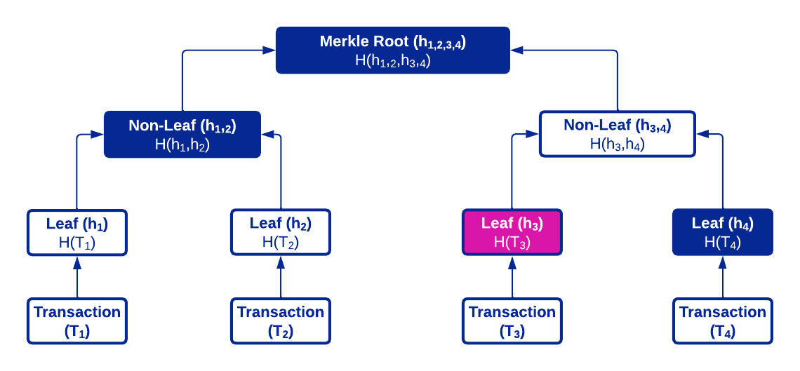

# Merkle Trees

A _Merkle tree_ is a data structure that takes a collection of inputs and outputs a hash value. Merkle trees are commonly used to verify and secure data in the blockchain, and to compare files in Git.

## Overview on Merkle Trees

A Merkle tree is built on _hashing_, a one-way algorithm that takes an input to create a unique string called a _hash value_. When an input is provided, a hash value will generate; however, the output cannot be used to uncover the input. Ideally, hashing is collision-resistant and no hashes should be the same.

In a blockchain, each leaf of a Merkle tree represents a block. These leaves are grouped and hashed to create non-leaf nodes representing each pair. This process repeats on the non-leaf nodes until only one non-leaf remains at the top of the tree. This node, known as the *Merkle root*, is a hash of the blockchain. If new transactions are added to the blockchain, a new root is created, and the previous one becomes its child node. 

The following diagram is an example of a Merkle tree for a blockchain containing four transactions.


## Verifying Elements in a Merkle Tree

To verify elements in a Merkle tree, you can use a Merkle proof. A _Merkle proof_ is a set of hashes that can be used to reconstruct a Merkle tree. If the Merkle root of the reconstructed tree matches the Merkle root that was originally given, the element exists in the tree. 

The following diagram is an example of a Merkle proof that shows transaction T<sub>3</sub> exists in the block.



To validate T<sub>3</sub>, the hashes for nodes h<sub>3</sub>, h<sub>4</sub>, h<sub>1,2</sub>, and h<sub>1,2,3,4</sub> must be included in the proof. Given the hashes for leaves h<sub>3</sub> and h<sub>4</sub>, the hash for node h<sub>3,4</sub> can be generated. This process is repeated on nodes h<sub>3,4</sub> and h<sub>1,2</sub> to create the hash for node h<sub>1,2,3,4</sub>, which is the Merkle root of the reconstructed tree. If it is identical to the Merkle root that was originally given, T<sub>3</sub> exists in the blockchain.

The following code snippet is an example of a Merkle proof. 

```solidity
//Source code: https://solidity-by-example.org/app/merkle-tree/

function verify(
    bytes32[] memory proof,
    bytes32 root,
    bytes32 leaf,
    uint index
) public pure returns (bool) {
    bytes32 hash = leaf;

    for (uint i = 0; i < proof.length; i++) {
        bytes32 proofElement = proof[i];

        if (index % 2 == 0) {
            hash = keccak256(abi.encodePacked(hash, proofElement));
        } else {
            hash = keccak256(abi.encodePacked(proofElement, hash));
        }

        index = index / 2;
    }

    return hash == root;
}
```

In this example, the `verify` function reconstructs the Merkle tree using a leaf, its index in the tree, and a Merkle proof. The function loops through the proof until the root hash is found. If the root hash of the reconstructed tree is identical to the given Merkle root (`root`), the element exists in the tree and the function returns `true`. Otherwise, it returns `false`.

## Additional Resources
For more details on Merkle trees and hash functions, refer to the following resources:

* [Merkle trees and Merkle proofs](https://decentralizedthoughts.github.io/2020-12-22-what-is-a-merkle-tree/?fbclid=IwAR2dAgbRCpOscHd-Rk1O2_N6qOJPGvAi8tGJXcFoqSHF4onEh2pE5VHe_ME)
* [Hash functions](https://decentralizedthoughts.github.io/2020-08-28-what-is-a-cryptographic-hash-function/)
* [Example of Validating Merkle Proofs](https://github.com/OpenZeppelin/openzeppelin-contracts/blob/master/contracts/utils/cryptography/MerkleProof.sol)